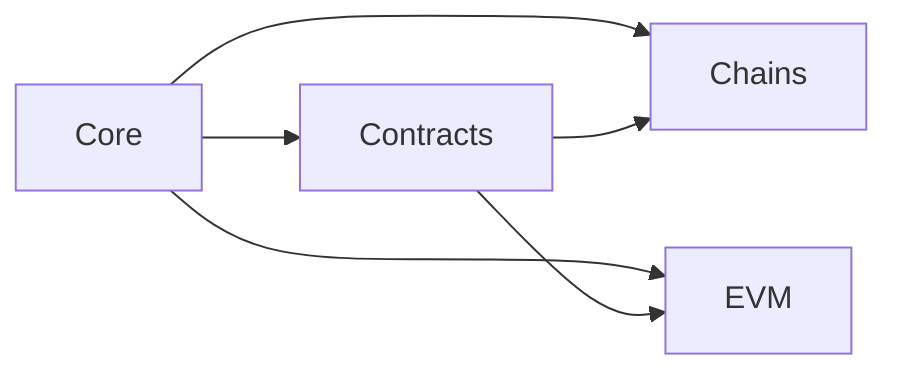
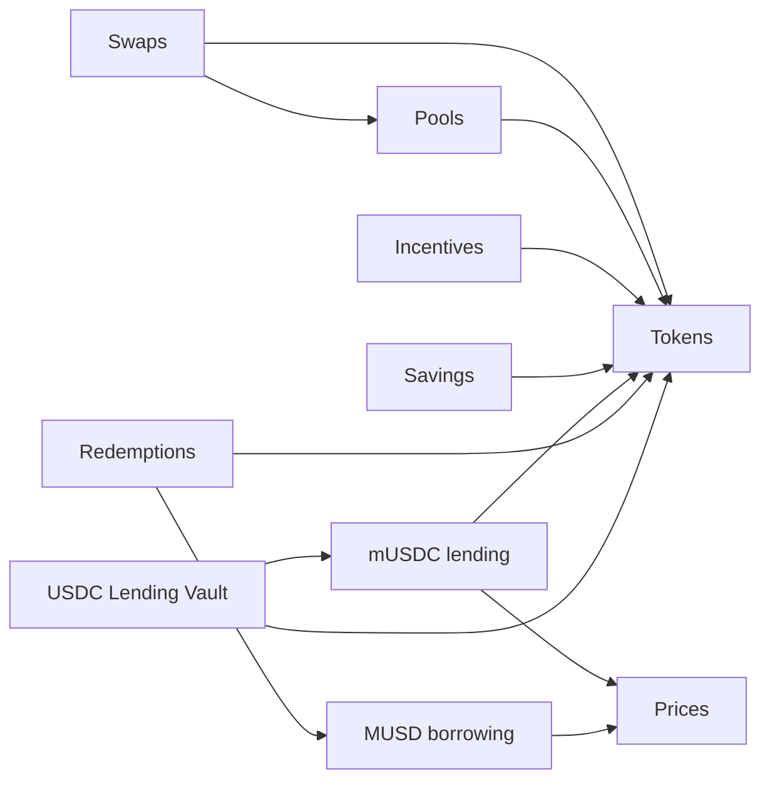

# Mezo Developer Kit Architecture

MDK combines TypeScript packages, maintained Mezo knowledge, and development
tools. This document explains how those parts fit together and where each
responsibility belongs.

- [Package map](#repository-areas): find the owner of a capability.
- [Dependencies](#dependency-direction): understand imports and composition.
- [Public API rules](#domain-and-public-api-rules): understand reads,
  calculations, execution, and injected application inputs.
- [Workflow composition](#implemented-workflow-composition): follow the
  relationships between protocol packages.

## Status and Authority

The [manifest](docs/manifest) owns the project baseline; this document owns
its detailed package map and technical boundaries. Package docs and exports
own exact APIs, indexed knowledge owns protocol facts, and shared standards
own contributor policy.

MDK is an experimental source alpha with private workspace packages and a
private standalone-project tooling pilot. Implementation, verification,
protocol support, and distribution have separate boundaries. The
[SDK reference](docs/reference/sdk.md) routes their current package contracts;
the [project utility guide](docs/guides/MDK_CLI.md) describes the tooling pilot.

## System Model

The system has three cooperating parts:

| Part                           | Responsibility                                                               | Starting point                            |
| ------------------------------ | ---------------------------------------------------------------------------- | ----------------------------------------- |
| Runtime packages               | Typed values, reads, calculations, and explicit execution                    | [Package map](#repository-areas)          |
| Knowledge and generation       | Evidence, stable identities, and generated runtime/reference projections     | [Knowledge overview](knowledge/README.md) |
| Development tools and guidance | Project creation, examples, contributor procedures, and optional agent setup | [Documentation index](docs/INDEX.md)      |

The following arrows show evidence and derived-data flow, not package imports:

```text
external sources and deployed evidence
  → validated knowledge and registry inputs
  → generated runtime data and reference material
  → public package APIs
  → adapters, examples, templates, and applications
```

Skills help apply current owners. Memory supplies retrieval pointers. Neither
is a runtime dependency or an authority over evidence, knowledge, architecture,
or code.

## Goals

MDK provides a trustworthy, composable, agent-friendly environment for
building on Mezo. Early releases focus on EVM development and a small number of
evidence-backed, high-value workflows.

The architecture optimizes for:

- TypeScript-first SDK, tooling, framework, template, and application
  development with intentional types at package boundaries;
- one maintained owner for every durable fact and public behavior;
- small packages with explicit responsibilities and dependency direction;
- framework-independent execution and protocol logic;
- deterministic calculations separated from RPC, wallets, UI, and storage;
- evidence-backed network, deployment, ABI, and protocol records;
- replaceable tooling, transports, framework adapters, and memory providers;
- reproducible verification for humans and coding agents.

## Non-Goals

MDK is not currently:

- a node or consensus-client SDK;
- a hosted RPC, indexer, database, or application backend;
- a general UI component system;
- a replacement for contract audits or protocol due diligence;
- a promise to support every Mezo or cross-chain workflow;
- an application monorepo for production products;
- a released set of SDK packages merely because package directories exist.

Production applications normally live in separate repositories and consume
MDK's public package entrypoints through the approved distribution. Local `examples/` and `templates/` exist to prove and
bootstrap that external developer experience.

### Residual candidate scope

The following themes remain outside the current domain scope:

| Candidate theme                      | Current disposition                                                                                                                                                                   |
| ------------------------------------ | ------------------------------------------------------------------------------------------------------------------------------------------------------------------------------------- |
| External-lending integrations        | Defer to a separately approved protocol/integration task; do not merge external venue accounting into the Mezo-native mUSDC market or USDC Lending Vault owners.                      |
| ve-asset marketplace or OTC behavior | Defer to separately approved scope with authoritative deployed evidence; incentives owns voting/locking behavior, not a marketplace.                                                  |
| Arbitrage or price-impact analytics  | Exclude product strategy and forecasts from protocol knowledge. Prices may classify a datum and swaps may own an amount-specific quote, but neither owns an arbitrage recommendation. |
| Portfolio strategy                   | Exclude as application/analytics policy; protocol modules expose bounded facts and deterministic rules, not allocation advice.                                                        |
| Wallet analytics                     | Exclude as application/analytics behavior; future public readers may supply typed inputs without making wallet profiling canonical knowledge.                                         |
| Hosted application infrastructure    | Exclude from MDK architecture; storage, indexing vendors, schedulers, and backends remain replaceable application choices.                                                            |
| UI behavior                          | Exclude application-specific UI and state policy; framework adapters consume public protocol APIs without redefining them.                                                            |
| Deployment operations                | Defer to separately approved CLI/Hardhat/Foundry and release-security work; no deployment writer or operational runbook is implied by planned package directories.                    |

These are current scope decisions, not permanent rejection of future work. A
human-approved task must establish the owner, evidence, security boundary, and
support goal before any deferred theme enters the roadmap.

## TypeScript-First Implementation

SDK packages, automation, tests, examples, templates, and generated applications
use TypeScript; JSX uses TSX. Solidity contracts and canonical data retain their
own formats. A tool-required language exception must be narrow and documented.

The [engineering baseline](docs/manifest#engineering-and-verification) and
[coding standard](docs/standards/coding.md) own implementation requirements.
Root package configuration and the lockfile own exact tool versions. Useful
public types and runtime validation are both required; types alone do not
validate external data.

## Repository Areas

Each package owns a coherent responsibility. Runtime packages consume public
exports and injected application inputs. They do not select hidden providers,
own application UI/state, or maintain independent copies of canonical facts.

### Foundations and shared services

| Package                                   | Owns                                                                                                                                           |
| ----------------------------------------- | ---------------------------------------------------------------------------------------------------------------------------------------------- |
| [EVM](packages/evm/README.md)             | Shared value validation, checksum policy, exact units, and scalar ABI codecs                                                                   |
| [Chains](packages/chains/README.md)       | Generated network identity and capability profiles; no RPC endpoint selection                                                                  |
| [Contracts](packages/contracts/README.md) | Deployment resolution, ABI projections, runtime identity, historical evidence, digests, and provenance                                         |
| [Core](packages/core/README.md)           | Block-consistent reads, bounded event scans, RPC/signer adapters, simulation, submission, receipt observation, and reconciliation coordination |
| [Tokens](packages/tokens/README.md)       | Token balances, allowances, and explicit approval workflows                                                                                    |
| [Prices](packages/prices/README.md)       | Typed price observations, normalization, confidence, freshness, and source policy                                                              |

EVM owns no network, deployment, protocol, provider, signer, or presentation
policy. Contracts consumes Chains identity and owns deployment/ABI resolution;
protocol packages retain workflow meaning and discovered-target checks. Core
coordinates execution while each protocol defines its required outcome.

### Protocol and workflow packages

| Package                                                                         | Owns                                                                                     |
| ------------------------------------------------------------------------------- | ---------------------------------------------------------------------------------------- |
| [MUSD borrowing](packages/protocols/musd-borrowing/README.md)                   | Classic borrower positions, debt/collateral calculations, hints, and direct operations   |
| [MUSD redemptions](packages/protocols/musd-redemptions/README.md)               | Redemption ordering, bounded hints, exact-output simulation, and settlement              |
| [MUSD Savings](packages/protocols/musd-savings/README.md)                       | Savings principal, indexed yield, and deposit/withdrawal accounting                      |
| [mUSDC lending](packages/protocols/musdc-lending/README.md)                     | Market shares, debt, collateral, interest, and market operations                         |
| [USDC Lending Vault](packages/protocols/usdc-lending-vault/README.md)           | Vault shares, allocation, wrapper accounting, and vault operations                       |
| [Institutional MUSD debt](packages/protocols/musd-institutional-debt/README.md) | Bounded Enclave/position reads and institutional fee, repayment, and health calculations |
| [Incentives](packages/protocols/incentives/README.md)                           | Gauges, locks, voting, rewards, and gauge custody                                        |
| [Pools](packages/protocols/pools/README.md)                                     | Basic and concentrated-liquidity pool discovery, math, liquidity, fees, and positions    |
| [Swaps](packages/swaps/README.md)                                               | Quotes, route comparison, execution, and swap outcomes                                   |
| [Bridges](packages/bridges/README.md)                                           | MUSD NTT preparation/recovery and separate cross-chain delivery observation              |

Each package reference defines implemented operations and qualification limits.
These ownership rows do not confer support on an operation or deployment.

### Tools and repository support

| Area                                                                           | Owns                                                                                      |
| ------------------------------------------------------------------------------ | ----------------------------------------------------------------------------------------- |
| [CLI](packages/cli/README.md)                                                  | Project creation, compatibility checks, guidance updates, and bundled reference retrieval |
| [Examples](examples/README.md) and [templates](templates/typescript/README.md) | Tested starting points using public APIs                                                  |
| [Knowledge](knowledge/README.md)                                               | Validated, evidence-linked Mezo facts and canonical registry inputs                       |
| [Documentation](docs/INDEX.md)                                                 | Architecture, guides, references, standards, troubleshooting, and historical decisions    |
| [Agent guidance](agents/README.md)                                             | Contributor/consumer skills, optional memory adapters, and evaluations                    |
| [Scripts](scripts/README.md)                                                   | Repository generation, verification, evidence, and workspace automation                   |

React, Hardhat, Foundry, and test-utils remain planned capabilities.
Their intended roles are framework adapters, tool-specific workflows, and
reusable deterministic test support. They must not duplicate protocol logic
or canonical facts; production packages must not consume test-only behavior.
Future ecosystem integrations belong under `extensions/` and compose public MDK APIs.

Create a package only for a demonstrated responsibility, consumer, and
verification path. Empty directories are not public architecture commitments.

## Dependency Direction

Arrows below point **from an importing package to its dependency**. The
foundation graph records direct MDK runtime dependencies:



EVM and Chains have no MDK runtime dependencies. EVM has its separately
declared external dependency. All current domain/shared-service packages
import EVM, Chains, Contracts, and Core; those repeated edges are omitted
from the next view, which shows their additional package imports:



Bridges, institutional debt, Tokens, and Prices need only the common
foundations. The CLI currently has no runtime SDK import dependency: its
distribution tooling packages matching artifacts and generates a reference
bundle. Artifact inclusion is separate from a runtime import edge.

Applications compose Savings/Vault with Incentives for gauge operations.
Incentives accepts an injected verified position-reader port for concentrated
liquidity; an application can bind the Pools reader to it. These connections
do not introduce Incentives/Pools or Savings/Incentives package dependencies.

The following rules apply:

- Declare every runtime import in the consuming package manifest and use a
  public entrypoint. Package cycles and deep imports are not allowed.
- Lower layers never import framework, template, example, or application code.
- Core and protocol logic remain framework-independent. Adapters and the CLI
  compose public behavior rather than becoming competing owners.
- EVM value consumers use the public EVM boundary; domain policy retains its
  own owner.
- Runtime packages do not depend on agent skills, memory providers, tasks,
  documentation tooling, or test-only behavior.
- Applications own persistence, scheduling, provider selection, wallet UI,
  and application state outside the runtime dependency graph.

## Domain and Public API Rules

### Explicit boundaries

Dependencies and configuration are passed explicitly. Hidden global clients,
wallets, registries, mutable singletons, and implicit network selection are not
allowed in core or protocol APIs.

Place behavior with the domain that defines its semantics. Avoid generic
`utils`, `helpers`, `common`, or vague service layers that combine unrelated
responsibilities. Shared abstractions should follow demonstrated reuse rather
than anticipated reuse.

### Pure domain logic

Financial and deterministic protocol calculations accept typed values and do
not perform RPC calls, read wallet state, access React, use storage, or depend
on global configuration. Units, precision, rounding, caps, and invalid states
must be explicit and tested at boundaries.

### Reads

A logical read that combines multiple values must expose or establish its
consistency coordinate, normally a block number. Required and optional failures
must remain distinguishable; partial transport failure must not silently become
zero, `false`, or empty protocol state.

### Writes

No write surface may treat a transaction hash as successful protocol state.
Write workflows must validate inputs and chain/account context, resolve the
intended deployment, simulate the exact call, submit safely, inspect receipt
outcome, and reconcile protocol state as the domain requires.

The [execution baseline](docs/manifest#shared-client-and-transaction-lifecycle)
defines responsibility, simulation, submission, and reconciliation. Current Core
and protocol package docs define their implemented interfaces and scoped
verification. Canonical public-writer support and publication retain separate gates.

### Errors and observability

Public boundaries use typed, actionable errors rather than raw provider
strings as the only contract. Libraries must not silently swallow errors.
Debug output is opt-in, structured, useful for reproducing encoded calls, and
redacts secrets and private data.

## Networks, Contracts, and Protocol Knowledge

`knowledge/` is the current canonical retrieval owner for evidence-backed Mezo
facts. Canonical means maintained owner, not self-authenticating truth.

For deployed behavior, block-pinned state and bytecode plus version-matched
verified source outrank descriptive prose. Records must retain exact scope,
source identity, verification coordinates, limitations, and review status.
Conflicts are preserved as evidence gaps or discrepancies rather than averaged
away.

[Network scope](docs/manifest#network-scope) defines the
maintained evidence scope: mainnet deployment/history and recent testnet state.
Long-term testnet archive recovery and historical certification are outside MDK's
required scope. Current testnet operations retain their own network, runtime,
freshness, and bounded transaction/reconciliation evidence requirements.

Network identity is separate from RPC-provider availability. Contract records
use stable identifiers and own addresses, proxy/implementation history, ABIs,
digests, activation ranges, and provenance. Protocol and workflow domains
reference those identifiers rather than copying volatile data.

The [contract evidence rules](docs/manifest#contract-identity-and-provenance)
define registry ownership and provenance classes. The [network scope](docs/manifest#network-scope)
defines capability profiles and the initial external Ethereum/Base identity scope.

The Prices knowledge module is the provider-neutral owner for source/feed identity and typed
datum, scaling, confidence, freshness, disagreement, and fallback-result
semantics. Its records reference Networks and Contracts; runtime package
imports are shown in the dependency map above. Protocol consumers may
reference Prices while retaining protocol-specific consumption semantics;
Pools retains DEX math, routing retains execution quotes, and analytics retains
stored projections. A source-class change is always explicit.

The [knowledge standard](docs/standards/knowledge-management.md) defines
human READMEs, machine indexes, content roles, lifecycle fields, stable
references, and structural/semantic validation. The [root catalog](knowledge/index.json)
discovers all maintained modules. Each resource is indexed by role, and
cross-domain identity uses logical references. The current layout identifier
remains 0.4. Catalog membership does not promote child support or review.

Classic MUSD, Savings, lending, vaults, pools, and incentives retain separate
accounting owners. The [economic-system map](docs/architecture/mezo-economic-system-composition.md)
explains their composition.

## Generated Outputs

Generated data, bindings, and reference material derive from canonical inputs.
They are not manually maintained when a generator exists.

Generators should be deterministic and record their input identity or digest
where practical. Verification must reject invalid canonical inputs and drift
between inputs and generated outputs. Templates, examples, docs, and agent
guidance must not become independent address or ABI stores.

## Agent Guidance and Memory

Contributor and consumer skills are authored under [agents](agents/README.md)
for separate audiences. Discovery directories are generated installation views.
The root `.agents/` tree is local and ignored; setup and refresh belong in the
[contributor agent guide](docs/guides/CONTRIBUTOR_AGENT_SETUP.md).

Human workflows remain usable without agent instructions. AGENTS files route
scoped work; skills provide procedures and link current owners. They do not
own protocol facts. Knowledge maintenance follows the knowledge standard and
its scoped instructions.

Memory is optional retrieval context under the
[memory contract](agents/memory/README.md). Provider state, credentials, and
local observations stay outside Git. Shared seeds remain small, reviewed
pointers; verified durable discoveries belong in knowledge, code, or current
docs. The repository must work without an external memory provider.

The [agent documentation baseline](docs/manifest#human-and-agent-documentation)
owns these constraints. [Contributor evaluation](docs/guides/CONTRIBUTOR_AGENT_EVALUATION.md)
owns discovery, context-efficiency, and behavioral checks.

## Testing and Release Boundaries

Verification covers public types and built entrypoints, deterministic behavior,
and the integrations crossed by a change. A supported vertical slice includes
implementation, tests, integration verification, documentation, an example,
agent guidance, and a knowledge/memory decision.

The [testing standard](docs/standards/testing.md) owns Vitest conventions,
fixtures, isolation, and documented tool exceptions.
[Contributor verification](CONTRIBUTING.md#verification) defines the three risk
levels and their required checks. [Security](SECURITY.md) owns sensitive
review and release requirements.

A passing source or local-fork check does not establish registry distribution
or production support. Package owners record scoped verification and support
separately; proposed knowledge remains review material.

## Implemented workflow composition

The package map links exact APIs and verification limits. These relationships
explain why related capabilities retain separate owners.

### Prices and event inputs

Prices supplies normalization, confidence, freshness, and a direct mainnet
Skip observation. Borrowing and Lending reuse its pure helpers while retaining
their protocol oracle paths. Core has no Prices dependency.

Core owns bounded raw event scans, coverage, and checkpoint candidates.
Applications own atomic persistence; protocols own the joins and post-state
checks needed to establish an outcome.

### Borrowing, Savings, lending, and vaults

Borrowing owns the classic borrower engine. Redemptions composes its verified
state with bounded queue/hint discovery, redemption math, exact-output
simulation, and direct execution/reconciliation. Core supplies pinned native
balances and validated receipt execution fees; the domain owns their effect
on protocol and wallet accounting.

Savings retains principal and indexed-yield accounting. Lending owns market
shares and debt. Vault imports Lending for underlying market composition while
retaining vault and wrapper accounting. Applications compose Savings/Vault
with Incentives for gauge staking and rewards.

### Pools, swaps, and gauge custody

Pools owns verified discovery, liquidity, positions, and fee math for basic
and concentrated-liquidity (CL) pools. Swaps composes those inputs into bounded
quotes, routes, and execution outcomes. Quote coverage and executable asset
profiles have different qualification boundaries.

The `@mezo-dev-kit/swaps/quotes` subpath exposes reader/route helpers and
bounded candidate comparison without writer exports. It preserves a common
coordinate, required/optional failures, and the difference between display
ranking and writer compatibility. It is not an isolated distribution.

CL coefficients derive from retained, digest-verified source; Contracts owns
runtime identity projections. Pools separates active, staked, and NFT liquidity,
requires stake-set evidence for a gauge depositor, and distinguishes principal
credit, manager fee accounting, and wallet payment. Incentives owns gauge
custody/emissions and uses the injected verified position-reader port.

Pools supplies CL swap-step, fee-split, and bitmap arithmetic. Swaps owns CL
router execution, crossing/fee state reconciliation, and wallet outcomes.
The initial MUSD/mUSDC writer profile is distinct from broader quote-only
routes; no Quoter or atomic mixed-family router is assumed.

### Institutional debt

Institutional debt owns bounded Enclave/position reads, independent aggregate
accounting, and fee/repayment/health calculations. Requested position and
authority subsets retain explicit coverage. Classic borrowing, partner writers,
and product-backing metrics remain separate responsibilities.

### Bridge source execution and delivery

Bridges separates current source preparation/recovery from delivery observation.
The NTT observer joins source-message and destination-redemption digests with
explicit confirmations, bounded candidate coverage, and reorg checks. Route
profiles derive from canonical knowledge.

The Native observer validates historical source calls and tuple/recipient
delivery using Contracts' historical evidence boundary and caller-supplied
consensus-block coverage. Historical observations do not certify a current
route or source writer.

NTT preparation checks current configuration and exact source intent; recovery
preserves existing sequence and queue custody. Applications compose Tokens
approvals through Core's explicit target resolver without adding a Bridges
runtime dependency on Tokens. Core's runtime verifier requires only the chain,
code, and storage methods it uses.

### Locks and voting

Incentives owns ordinary veBTC/veMEZO locks and deterministic boost, epoch, and
vote-allocation inputs. Its bounded reads distinguish direct custody, locked
supply, stored boost, and current voting power. Pool, boost, and validator
voting retain independent qualification paths.

The [execution baseline](docs/manifest#protocol-execution-boundaries) and
[bridge outcome baseline](docs/manifest#events-and-bridge-outcomes) define the
shared operation boundaries. Package owners retain detailed support limits.

## Standalone project utility

The [standalone tooling baseline](docs/manifest#standalone-project-tooling) defines the private
`@mezo-dev-kit/cli` artifact, application-owned instructions, exact SDK
compatibility, generated consumer corpus, and recoverable updates.
[The utility guide](docs/guides/MDK_CLI.md) owns executable private-pilot examples.

## Architecture Changes

Use an agreed task, issue, or PR for architectural, multi-package, migration,
public-interface, or protocol-sensitive work. Update the affected manifest
section and this detailed map when accepted ownership or dependency rules change.
Existing standards and package contracts change together where affected.

Follow [Changing the baseline](docs/manifest#changing-the-baseline) for versioning
and review. Retain a separate historical decision when its alternatives and
rationale warrant one; it does not become a second current-policy owner.
