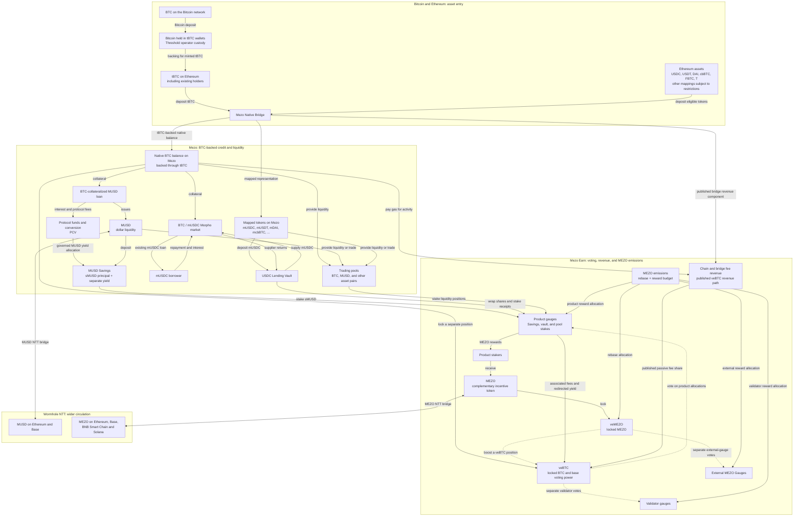

# How Mezo's Bitcoin economy fits together

Mezo is built around **borrowing against BTC while retaining exposure to
Bitcoin**, and making the resulting activity support a wider Bitcoin economy.
BTC supplies collateral, pays for transactions, and anchors voting power.
MUSD supplies dollar liquidity. MEZO complements BTC by funding incentives and
amplifying the influence of locked BTC. This is the starting point for
understanding the products and bridges below.

Mezo Earn adapts the **ve(3,3)** model used by Aerodrome: participants lock assets,
vote on reward destinations, and receive revenue associated with their votes.
Mezo changes the center of that model to BTC. Locked BTC provides the base
weight; locked MEZO can boost it. The intended result is a feedback loop between
borrowing, liquidity, fees, and participation—not simply a collection of yield
products. This framing comes from sections 1–3 of the
[Mezo Earn whitepaper retained in this repository](../../knowledge/protocols/incentives/artifacts/mezo-earn-whitepaper-2025-12.pdf)
and the [official Mezo introduction](https://mezo.org/docs/users/introduction/mezo-self-service-banking/).

## The system map: bridges, borrowing, voting, and emissions

Read from asset entry into Mezo, then follow the borrowing and Earn branches.
Solid arrows show asset, position, or revenue flows. Dotted arrows show voting
influence. The map combines the published product architecture with MDK's
recorded protocol relationships; the route and evidence distinctions below
matter when moving from understanding the system to using it.

The [owned relationship inventory](../../knowledge/generated/economic-relationships.md)
provides the structured connections and explicit coverage gaps behind this
explanation. Their composition and evidence dispositions were accepted on
October 9, 2026. That review does not qualify a route or turn a dated model into
current evidence; each relationship retains its own source scope and limitations.

The Bitcoin entry arrows show the deposit direction. Returning to Ethereum
releases tBTC; returning to Bitcoin additionally uses tBTC redemption to pay
BTC to a Bitcoin address. A borrowing position, a liquidity position, and a
veBTC lock are separate allocations of capital. The diagram does not put the
same BTC into all three at once.

### How voting and emissions complete the flywheel

The intended economic loop is:

1. BTC enters Mezo and supports borrowing, trading, and other activity.
2. That activity produces loan revenue, swap fees, and chain/bridge revenue.
3. veBTC participants receive the applicable revenue and vote on where rewards
   should go; veMEZO participants can supply a boost to those BTC positions.
4. Allocated MEZO rewards encourage deposits and liquidity in selected products.
5. More usable liquidity is intended to support further borrowing and trading,
   producing more activity for the loop.

The final step is an economic objective, not a guaranteed growth rate or return.
The [official Earn overview](https://mezo.org/docs/users/mezo-earn/overview/)
explains the fee sources and participant roles.

A **gauge** is a reward destination. Product gauges hold staked positions;
validator and external gauges have different beneficiaries. Voting directs
allocations; it does not itself deposit BTC into a loan or supply liquidity.

**MEZO emissions and earned fees are different sources of value.** The minter
creates an epoch's MEZO budget. Part goes to veMEZO rebases—distributions to
eligible MEZO locks—and the remainder goes through allocation contracts called
splitters. The chain splitter divides rewards between validators and the
ecosystem. The ecosystem splitter divides its portion between product gauges
and external incentive gauges. These are portions of one emission budget.

| Participation                           | What it influences                                                      | What the participant can receive                                                                                                     |
| --------------------------------------- | ----------------------------------------------------------------------- | ------------------------------------------------------------------------------------------------------------------------------------ |
| Lock BTC as veBTC                       | Product-gauge and validator votes, in separate voting domains           | Associated voter fees and incentives; official docs also describe passive chain/bridge fee revenue.                                  |
| Lock MEZO as veMEZO                     | Boost votes for veBTC positions; separate votes on external MEZO Gauges | Eligible rebases and posted voting incentives. Boosting someone else's veBTC does not transfer their product revenue to the booster. |
| Stake Savings, vault, or pool positions | Supplies the position rewarded by a product gauge                       | Allocated MEZO rewards; the product determines which underlying yield or fees are redirected to voters.                              |
| Operate a validator                     | Provides a destination for the validator reward branch                  | Allocated rewards through its validator gauge.                                                                                       |

The **matching market** connects BTC holders seeking more influence with MEZO
holders supplying boost votes. A veBTC holder can post incentives on a boost
gauge; veMEZO holders vote for it and receive those incentives. veMEZO therefore
complements BTC's voting role without requiring the two locks to have the same
owner. It also votes directly in the separate external-gauge domain. See the
[official veMEZO explanation](https://mezo.org/docs/users/mezo-earn/lock/vemezo/).

The [incentives reference](../../knowledge/protocols/incentives/README.md)
owns the deployed voting, boost, and allocation rules. Its
[emission model](../../knowledge/protocols/incentives/records/emissions.json)
records a difference from the whitepaper's rebase description: the deployed
minter uses historical, time-decayed voting power rather than a simple locked
supply figure. The whitepaper explains the design; that wording is not a formula
to copy into an implementation.

## What “BTC on Mezo” means

The standard bridge path has two distinct custody layers:

1. **Bitcoin to tBTC.** BTC stays on the Bitcoin network in tBTC wallets secured
   by Threshold Network operators using threshold cryptography. tBTC on Ethereum
   represents that deposited Bitcoin. “Threshold custody” refers to this
   distributed operator arrangement, not one custodian holding a private key.
   See [Threshold's tBTC documentation](https://docs.threshold.network/tbtc-v2).
2. **tBTC to Mezo.** The Native Bridge holds the Ethereum-side asset and credits
   its Mezo representation. For tBTC, that representation is Mezo's native BTC
   balance, used for gas and the BTC collateral shown in the map. The
   [recorded BTC/tBTC asset relationship](../../knowledge/workflows/bridges/records/assets.json)
   distinguishes native BTC on Mezo from the ERC-20 tBTC released on Ethereum.

A user can start with **BTC in a Bitcoin wallet**: the deposit flow handles the
tBTC and Mezo bridge legs. Or a user can start with **tBTC already on Ethereum**
and enter through the Native Bridge. “Deposit directly from Bitcoin” describes
the user's entry point; the underlying path still uses tBTC. The
[official deposit guide](https://mezo.org/docs/users/getting-started/deposit-assets)
and [bridge overview](https://mezo.org/docs/users/mainnet/bridges/)
describe these entry and exit paths.

Thus, Mezo's native BTC is backed through tBTC, while Mezo contracts operate on
a native chain balance. It is not a Bitcoin UTXO held directly inside the MUSD
contract, nor is every bridged Bitcoin wrapper automatically the native gas or
collateral asset.

## The bridge picture extends beyond BTC and USDC

The Native Bridge connects Ethereum assets with their representations on Mezo.
Wormhole NTT connects MUSD and MEZO to their respective remote networks.
They have different asset mappings and delivery mechanisms.

| Asset or family                | Connection                                                            | Representation and relevant distinction                                                                                   |
| ------------------------------ | --------------------------------------------------------------------- | ------------------------------------------------------------------------------------------------------------------------- |
| BTC / tBTC                     | Bitcoin ↔ tBTC on Ethereum ↔ Mezo                                     | Native BTC on Mezo; tBTC when withdrawn to Ethereum; native BTC after redemption to Bitcoin.                              |
| USDC, USDT, DAI                | Ethereum ↔ Mezo Native Bridge                                         | Mapped tokens such as mUSDC, mUSDT, and mDAI. mUSDC supplies the Morpho lending branch.                                   |
| cbBTC, FBTC, T                 | Ethereum ↔ Mezo Native Bridge                                         | Separate mapped tokens, including mcbBTC, mFBTC, and mT; they keep their own underlying asset identity.                   |
| USDe, swBTC, SolvBTC, xSolvBTC | Retained Ethereum ↔ Mezo mappings                                     | Deposit restrictions apply; a retained mapping does not mean new deposits are available. See the dated observation below. |
| MUSD                           | Wormhole NTT: Mezo ↔ Ethereum / Base                                  | MUSD locked on Mezo backs remote issuance; the reverse path burns the remote representation and unlocks MUSD.             |
| MEZO                           | Wormhole NTT: Mezo ↔ Ethereum / Base / BNB Smart Chain (BSC) / Solana | The dedicated MEZO guide documents this wider network set.                                                                |

The [dedicated MUSD bridge guide](https://mezo.org/docs/users/borrow/musd-bridge/)
and [dedicated MEZO bridge guide](https://mezo.org/docs/users/mezo/mezo-bridge/)
establish the published network distinction. **BSC and Solana belong to the
MEZO route list; those guides do not establish MUSD routes to those chains.**
They also distinguish the Mezo app from Wormhole's Portal interface; a route
need not appear in every interface.

For the broader Native asset list, the retained
[October 7 bridge verification](../../knowledge/workflows/bridges/artifacts/private-scope-reverification-2026-10-07.json)
checks the mapped tokens and source minimums. It found ordinary deposits blocked
for **USDe, swBTC, SolvBTC, and xSolvBTC**. The
[asset restriction review](../../knowledge/workflows/bridges/review/gaps.md#native-bridge)
keeps the observation separate from withdrawal availability and explains the
inconsistent wording in the SolvBTC/xSolvBTC wind-down notice. These are dated
configuration facts, not a live quote or a promise that every other route is
ready for a transaction.

Wider circulation also connects back to incentives. External MEZO Gauges direct
rewards toward MUSD liquidity on Curve and Uniswap on Ethereum and Aerodrome on
Base. The [official destination guide](https://mezo.org/docs/users/mezo-earn/vote/mezo-gauges/where-your-vote-goes/)
describes those paths. Aerodrome adds another voting layer: MEZO incentivizes
veAERO votes, which direct AERO rewards to liquidity providers. MDK's
[external-gauge evidence](../../knowledge/protocols/incentives/records/third-party-voting-rewards.json)
separates these published destinations from independently verified delivery.

## Borrowing creates the dollar liquidity

The flagship MUSD path starts with a **trove**, a position holding BTC collateral
against MUSD debt. Borrowing issues MUSD; interest accrues on the debt; repayment
reduces it. The borrower can use the MUSD while their BTC remains collateral.
The [MUSD system explanation](../reference/musd-system.md) and
[borrowing rules](../reference/musd-borrowing.md) describe that engine.

MUSD holders can also [redeem MUSD for BTC collateral](../reference/musd-redemptions.md)
from eligible positions, subject to ordering and fees. The filled MUSD is burned
and position debt decreases. Redemption and collateralized issuance contribute
to the dollar-peg mechanism. Liquidation handles undercollateralized positions;
the **Stability Pool** can consume deposited MUSD to offset liquidated debt in
exchange for the associated collateral. This is separate from MUSD Savings.

The **BTC/mUSDC Morpho market** is an additional credit path. Its borrowers use
BTC collateral to borrow existing mUSDC supplied by lenders. The
[USDC Lending Vault](../../knowledge/protocols/vaults/usdc-lending/README.md)
accepts mUSDC deposits and supplies that market through an adapter. Interest
paid by borrowers contributes to supplier returns and vault-share value.
Available liquidity constrains borrowing and withdrawals.

This is where the MUSD/mUSDC distinction matters: **MUSD is issued by Mezo's debt
systems; mUSDC represents USDC brought through the Native Bridge.** Their loans
have different debt, interest, collateral-health, and liquidation accounting.
See the [BTC/mUSDC lending model](../../knowledge/protocols/lending/musdc/README.md).

[Institutional MUSD debt](../../knowledge/protocols/musd/institutional-debt/README.md)
adds an Enclave custody and pledged-collateral path. It uses separate positions
and health accounting from classic troves. The tBTC bridge path in the main
diagram should not be used to infer that institutional custody follows the same
flow.

## Savings and pools turn activity into participant returns

**MUSD Savings** accepts existing MUSD and issues **sMUSD** principal receipts
one-for-one. Yield is recorded separately and paid in MUSD. **PCV**
(protocol-controlled value) manages protocol funds and distributions, connecting
borrowing interest and fees to governed yield allocation and BTC-to-MUSD
conversion. A Savings deposit does not create another loan. See the
[Savings model](../../knowledge/protocols/musd/savings/README.md).

This describes the recorded deployed accounting. Official product prose describes
an appreciating receipt exchange rate instead; the
[Savings source review](../../knowledge/protocols/musd/savings/review/source-conflicts.md)
preserves the discrepancy and retains a new generation check as candidate
evidence. Keep that qualification when moving from the system explanation to a
current calculation.

The exact allocation of protocol revenue also needs its own qualification.
Official guides disagree about the recipient after the bootstrap loan is repaid;
the [MUSD revenue review](../../knowledge/protocols/musd/review/revenue-flows.md)
keeps that destination unresolved. Passive chain/bridge revenue and external
incentive delivery have separate gaps in the
[incentive revenue review](../../knowledge/protocols/incentives/review/revenue-flows.md).
Neither diagram arrows nor contract names prove a settled payout.

**Trading pools** let users exchange assets and charge swap fees. Liquidity
providers hold LP tokens or, for concentrated liquidity, positions over price
ranges. Eligible positions can be staked in gauges. This connects the trading
venue to the voting-and-emissions loop at the top of the page. The
[pool model](../../knowledge/protocols/pools/README.md) describes positions;
[swap workflows](../../knowledge/workflows/swaps/README.md) explain trade routes.

| Position                             | Principal or ownership                         | Return path                                                                                                                           |
| ------------------------------------ | ---------------------------------------------- | ------------------------------------------------------------------------------------------------------------------------------------- |
| sMUSD held directly                  | MUSD Savings principal receipt                 | Separately claimable MUSD yield.                                                                                                      |
| sMUSD staked in its gauge            | Stake backed by sMUSD                          | MUSD yield redirects to voters; the staker earns allocated MEZO.                                                                      |
| Lending-vault shares held directly   | Claim on the vault's assets                    | Borrower interest contributes to share value, subject to accounting and fees.                                                         |
| Vault wrapper receipts held directly | Claim on remaining vault-share backing         | With a configured gauge, the wrapper separates yield in vault shares for the gauge's voter-revenue path, even before receipt staking. |
| Vault shares wrapped and staked      | Gauge stake in receipts backed by vault shares | The wrapper separates yield in vault shares for voter revenue; the staker earns allocated MEZO.                                       |

Wrapping and staking add ownership and reward-accounting layers to an existing
position. They do not multiply its principal or let a staker also claim yield
already redirected to voters. Similarly, putting borrowed MUSD into Savings
does not repay the original BTC-backed loan.

For the lending vault, wrapping and staking have distinct effects: the
[recorded wrapper accounting](../../knowledge/protocols/vaults/usdc-lending/records/accounting.json)
conditions yield harvesting on a configured gauge and share-price growth.
Unstaking a wrapped receipt does not by itself return to the yield entitlement
of holding unwrapped VaultV2 shares.

## What this explanation is based on

This is a human explanation of the economic system, reviewed against the
published documentation on **October 8, 2026**. The sources have distinct jobs:

- The **December 2025 Earn whitepaper**, especially sections 1–6, explains the
  BTC-centered design, ve(3,3) lineage, matching market, and emission structure.
  Its retained file is linked above; the indexed
  [source record](../../knowledge/protocols/incentives/sources/catalog.json)
  records provenance and known deployment differences.
- **Official Mezo and Threshold guides** establish the published product,
  custody, and bridge picture. Dedicated token guides supply the network sets;
  broad bridge-page wording is not used to extend those sets.
- **MDK's indexed knowledge** supplies versioned protocol accounting and dated
  deployment observations. It also records where published descriptions differ
  from executable behavior. Borrowing depends on each protocol's configured
  oracle, not an arbitrary market quote; see
  [price observations and DEX quotes](../guides/price-selection-and-dex-quotes.md).

The full Mezo system is broader than MDK's qualified workflows. In particular,
Bitcoin delivery, MEZO NTT, BSC/Solana, and additional Native mappings remain
outside the currently qualified bridge slice described in the
[bridge knowledge overview](../../knowledge/workflows/bridges/README.md).
That coverage limit belongs to MDK; it does not remove those published products
from Mezo's architecture.

Use the [knowledge subject index](../../knowledge/README.md) to explore the
system further, and the [SDK reference](../reference/sdk.md) to see which parts
an application can currently access through MDK.
